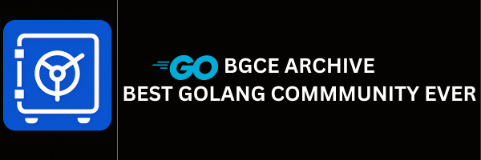

# BGCE Archive – Best Go Community Ever 🐹

 

<!--
  Note: Go Report Card currently only scans one module.
  Since this repo is a monorepo with multiple Go modules,
  please check report cards per microservice individually.
-->

### Go Report Cards (per module)

  

> A living digital archive to preserve the best from the Go community — notes, templates, projects, and stories.

---

## 🌐 Golang Community Vault

  

Welcome to **Golang Community Vault**, a community-driven archive to collect, organize, and preserve knowledge, tools, and stories from the Go ecosystem.

Whether you're a beginner, job seeker, seasoned contributor, or mentor — **this is where we grow together**.

---

## 🎯 Purpose

The **Golang Community Vault** is more than a repository — it's a shared learning platform:

- 📚 Preserve community-generated knowledge and code
- 🤝 Promote open, collaborative learning
- 🔎 Help job seekers learn from real-world resources
- 🧠 Gather scattered content into a single, organized place

---

## 📁 Folder Structure

| Folder      | Type          | Description                                              |
| ----------- | ------------- | -------------------------------------------------------- |
| `cortex`    | Microservice  | Handles **category** and **sub-category** domain logic   |
| `docs`      | Documentation | Project docs, UI assets, and archive metadata            |
| `ecommerce` | YT Project    | Go e-commerce app from @uitshabib's YouTube tutorials    |
| `scripts`   | Scaffold      | Reusable setup scripts for Go microservice projects      |
| `skeleton`  | Template      | Base starter template to launch new services inside BGCE |

---

## 📚 Read the Book

📖 **Full documentation available at:**  
🔗 [https://nesohq.github.io/bgce-archive/](https://nesohq.github.io/bgce-archive/)

---

## 💬 Stay Connected

| Platform      | Join Link                                                                                                          |
| ------------- | ------------------------------------------------------------------------------------------------------------------ |
| 💬 Discord    | [Join our Discord](https://discord.gg/xUVYrGaXS3) — real-time discussions and support                              |
| 📘 Fb Group   | [Join the FB Group](https://www.facebook.com/groups/1118405403169990) — success stories, posts, and community news |
| 🎥 Yt Channel | [GoWithHabib](https://www.youtube.com/@gowithhabib) — tutorials, deep dives, and community videos                  |

---

## 🤝 How to Contribute

- 📌 Share notes, articles, diagrams, or projects
- 🧱 Help improve templates, scripts, or automation
- 🌐 Contribute to the [BGCE archive book](https://nesohq.github.io/bgce-archive/) or help shape the future **Web Vault**
- 🌐 Contribute to the **BGCE archive** Repository microservices

See [`CONTRIBUTING.md`](./CONTRIBUTING.md) for more info.

---

## ✨ Together, We Learn & Grow

> _“Code fades. Community lasts.”_  
> Archive knowledge. Share experiences. Help the next generation of Gophers thrive.

---

## License

This project is licensed under the Creative Commons Attribution-NonCommercial 4.0 International License (CC BY-NC 4.0).

You may share, copy, redistribute, and adapt the material for **non-commercial** purposes only. You must give appropriate credit to BGCE Archive / NesoHQ and indicate if changes were made. Commercial use is prohibited.

See full license details at [creativecommons.org/licenses/by-nc/4.0](https://creativecommons.org/licenses/by-nc/4.0/).

---

_© 2025 NesoHQ_
